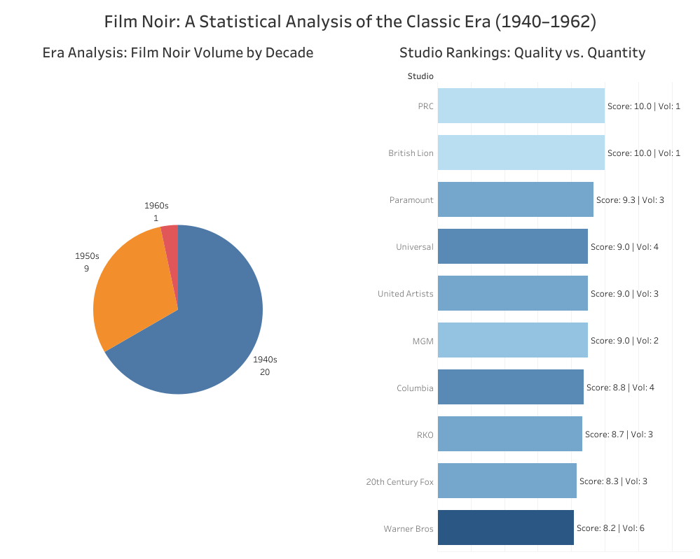

# Shadows & Cinema: A Data Analysis of the Film Noir Era (1940–1962)

## Project Overview
This data analysis project investigates the "Golden Age" of American Film Noir. By utilizing a curated dataset of iconic films, this project identifies patterns in studio production, thematic intensity, and the evolution of the genre's famously cynical narrative structures. 

The goal was to demonstrate a full **Data Pipeline**: from raw Excel data to Python-based cleaning (ETL), and finally to interactive Business Intelligence (BI) visualization in Tableau.

## Tech Stack
* **Language:** Python 3.13
* **Libraries:** Pandas, Openpyxl
* **Visualization:** Tableau Public
* **Data Source:** Curated Historical Film Data (XLSX)

---

## Data Pipeline & ETL
The raw data underwent a rigorous cleaning process using **Python** to ensure it was "Tableau-ready." Key transformations included:

1.  **Column Normalization:** Standardized headers (e.g., `Noir Score (1-10)`) to `noir_score` for coding efficiency.
2.  **Missing Value Imputation:** Handled null values by applying the dataset mean.
3.  **Feature Engineering:**
    * **Decade Grouping:** Calculated the decade for each film to enable chronological analysis.
    * **Sentiment Categorization:** Created a boolean flag (`is_tragic`) to distinguish between "Happy" and "Tragic/Bitter" endings.

---

## Key Insights & Visualizations
The final **Tableau Dashboard** provides two primary lenses of analysis:

### 1. Era Analysis (The Volume)
A distribution analysis showing the density of Noir productions. The data confirms the **1940s** as the peak of the genre, with a significant decline in volume moving into the early 1960s.

### 2. Studio Rankings (Quality vs. Quantity)
A comparative bar chart showing Average Noir Scores by Studio. 
* **Findings:** While "Major" studios like **Warner Bros** produced the highest volume, independent or smaller productions (like **British Lion** and **PRC**) achieved higher "Intensity" scores, often due to their focus on the gritty, low-budget "B-movie" style that defined the aesthetic.

---

## How to Use
1.  **Process Data:** Run `film_noir.py` to transform the raw `Film_Noir_Dataset.xlsx` into `cleaned_film_noir_data.xlsx`.
2.  **View Dashboard:** Open `Film_Noir_Analysis_Project.twbx` in Tableau to explore the interactive filters.
3.  **Interactivity:** Click on a **Decade** in the Pie Chart to automatically filter the **Studio Rankings** for that specific era.

---

## Project Structure
* `Film_Noir_Dataset.xlsx`: The original raw data.
* `film_noir.py`: The Python ETL script.
* `cleaned_film_noir_data.xlsx`: The processed output used for the dashboard.
* `Film_Noir_Analysis_Project.twbx`: The packaged Tableau Workbook.
* `Film_Noir_Dashboard.png`: The Dashboard made with Tableau

---
